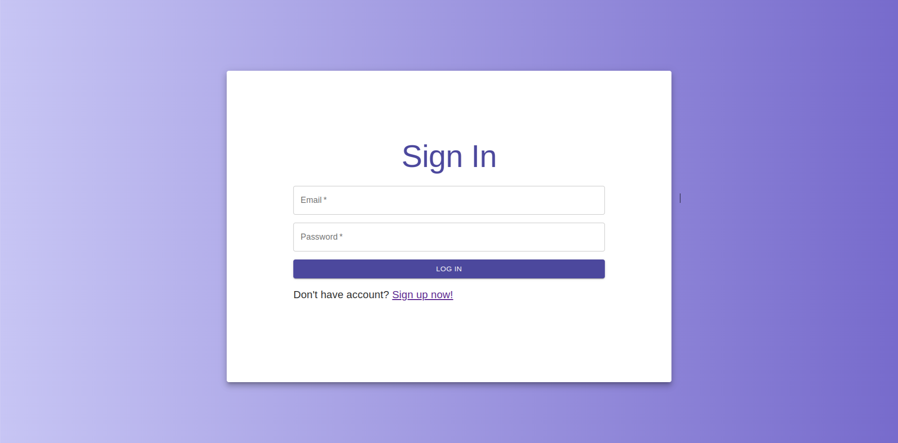
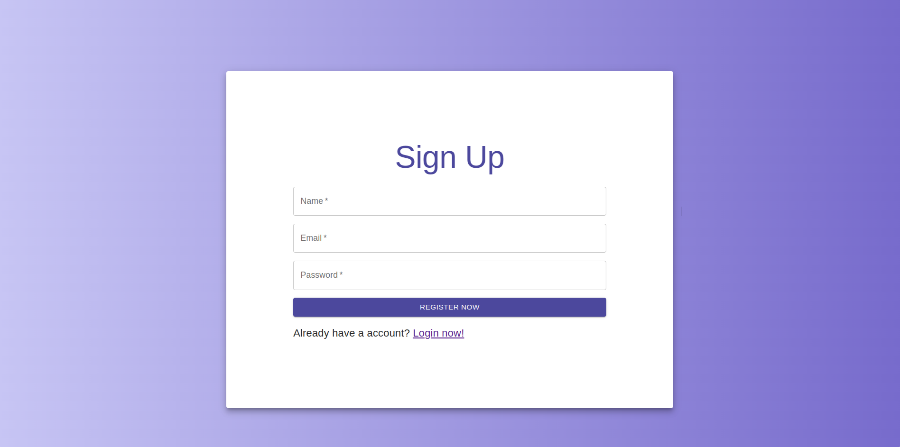
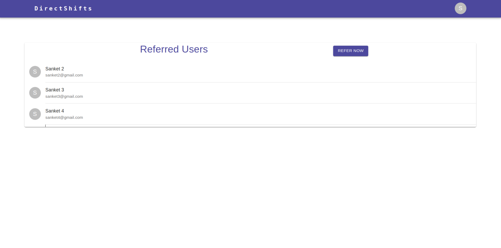
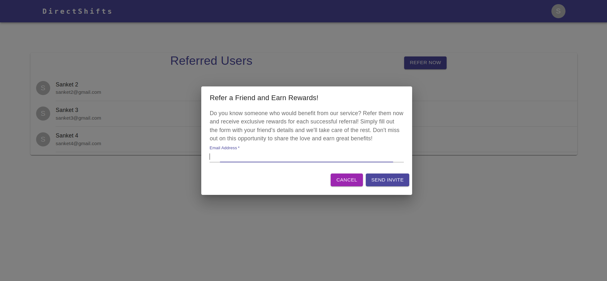
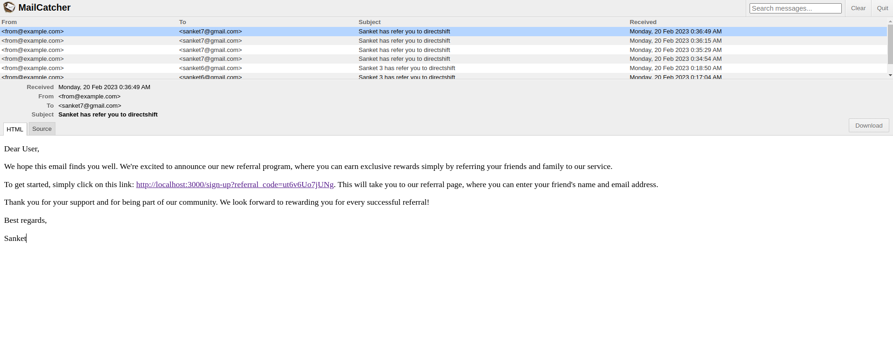

# README

## Pre-requistes

1. Ruby version - `3.0.1`
2. Rails version - `7.0.4`
3. Node.js version - `v14.16.0`
4. MySQL version - `MySQL 5.1`
5. Mail catcher

## Project setup

1. Clone the project from github repo - [https://github.com/SanketKarve/directshifts-assignment](https://github.com/SanketKarve/directshifts-assignment)
2. Create `.env` file which have below keys. set appropriate values
```
DATABASE_USERNAME=<DB_USERNAME>
DATABASE_PASSWORD=<DB_PASSWORD>
```
3. Setup the project using `bin/setup`
4. To run the project `bin-webpacker-dev-server & rails s`
5. The project will start at [http://localhost:3000](http://localhost:3000)
6. Start Mail Catcher([https://mailcatcher.me/](https://mailcatcher.me/)) in other terminal by using command `mailcatcher`
7. Go to http://127.0.0.1:1080/ to check the mails. As mail are send through smtp://127.0.0.1:1025

## API Collection

[API Collection](./api-collection.json)

## Project screenshots

1. Sign in screen

2. Sign up screen

3. Home screen

4. Refer invite screen

5. Mail Catcher Screen
